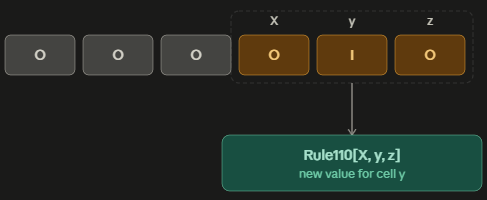

<!-- _class: lead -->
# 駕馭 Scala 型別系統：</br>在型別層打造自動機
###### Exploiting Scala Type System: Building Type-Level Automaton

Speaker: Kyle Lin (ChAoS)

---

## Table Of Content

- Introduction to Type Level Programming
- Building Rule 110 Automaton
- Applications
- Conclusion

---

<!-- _class: lead -->

# Introduction to</br>Type Level Programming

---

## General Type Level Programming


- Compile-Time Evaluation:</br>Evaluate once,</br>**no overhead** in runtime! 
- Strict Logic Check:</br>Let compiler check for you,</br>**no ambiguity**!

---

## Scala Type Level Programming


- Scala 3 introduces few type operations allow us to type level programming more conveniently!
  - **Type matching**
  - Macro
  - Union and Intersection Types
  - **Contextual Abstractions**
  - And more...!

---

<!-- _class: lead -->

# Building Rule 110 Automaton

---

## Rule 110


- Known as Rule 110 cellular automaton
- Elementary cellular automaton
- Turing Complete!

$$
\begin{array} {|c|c|}
\hline
 111 & 110 & 101 & 100 & 011 & 010 & 001 & 000 \\ \hline
 0 & 1 & 1 & 0 & 1 & 1 & 1 & 0 \\ \hline
\end{array}
$$

---

## Structure

Our type-level Rule 110 program constists of following minimum definition:

- Natural Number ($\mathbb{N}$)
- Cell (binary state, e.g. 1 or 0)
- Heterougeneuos List
- Rule 110 State Transformer
- Automaton (Itself)

---

## Natural Number ($\mathbb{N}$)

Summarized from Peano Axioms:

- Starts from 0
- There's always an successor for a natural number

```scala
sealed trait Nat
class Zero extends Nat
class Suc[N <: Nat] extends Nat

// 0: Zero
// 1: Suc[Zero]
// 2: Suc[Suc[Zero]]
// and so on...
```

---

## Cell

```scala
class I
class O
type Cell = I | O
```

*Note: avoid using object to declare, as it will only declare it under term level, requires later type usages to need to add `.type` reference*

---

## Heterougeneuos List

- Every types of elements in list may differ
- *Dependent Type*: Tracks the length of list in each node of list

```scala
sealed trait HList {
  // Length of list
  type N <: Nat
}
```

---

## Heterougeneuos List

```scala
case class HNil() extends HList {
  type N = Zero
}

case class ::[H, T <: HList]()(using val list: T) extends HList {
  type N = Suc[list.N]
}
```

*Bonus: This design can be exploited with invalid type being in the list, can you design a well-typed sized vector?*

---

## Rule 110 State Transformer

```scala
type Rule110[X <: Cell, Y <: Cell, Z <: Cell] = (X, Y, Z) match
  case (O, O, O) => O
  case (O, O, I) => I
  case (O, I, O) => I
  case (O, I, I) => O
  case (I, O, O) => O
  case (I, O, I) => I
  case (I, I, O) => I
  case (I, I, I) => I
```

---

## Automaton

- Idea: Scan through the list with window size of 3

<style>
img[alt~="center"] {
  display: block;
  margin: 0 auto;
}
</style>




---

## Automaton

- Generation Scanner / Generator

```scala
type Next[X <: Cell, Items <: HList] <: HList = Items match
  case y :: z :: rest => Rule110[X, y, z] :: Next[y, z :: rest]
  case y :: HNil => y :: HNil
  case HNil => HNil

type Start[Items <: HList] <: HList = Items match
  case x :: rest => x :: Next[x, rest]
  case HNil => HNil
```

---

## Automaton

- Geneartion Iterator

```scala
type Gen[N <: Nat, State <: HList] <: HList = N match
  case Suc[n] => State :: Gen[n, Start[State]]
  case Zero   => HNil
```

---

## Result

- A state-preserved Rule 110 Automaton Iteration Generator!

```scala
Gen[_2, O :: O :: O :: O :: I :: O :: HNil] =:=
  (O :: O :: O :: O :: I :: O :: HNil) ::
  (O :: O :: O :: I :: I :: O :: HNil) ::
  HNil

// _2 is shorthand type alias for Suc[Suc[Zero]]
```

---

<!-- _class: lead -->

# Applications

---

## Reflection

So far we've have covered how to program an automaton, Rule 110 in this case, directly in type level, but this is not meant to be in any production code...

---

## Useful Applications, Pt.1: Stateful Handling



By embedding type informations into function, and adding constrains, we can use type to construct a type-safe file stream class.

Worth to notice this contains usage of Phantom Type.

---

## Useful Applications, Pt.1: Stateful Handling

- Rough sketch of type-safe filestate class implementation
```scala
sealed trait StreamState
sealed trait Closeable extends StreamState

class Unopened extends StreamState
class Open extends Closeable
class EOF extends Closeable
class Closed extends StreamState
```

---

## Useful Applications, Pt.1: Stateful Handling

- Rough sketch of type-safe filestate class implementation

```scala
class FileStream[S <: StreamState] private (path: Option[String]):
  def open(p: String)(using S =:= Unopened): FileStream[Open] = ???

  def read()(using S =:= Open): (String, FileStream[Open | EOF]) = ???

  def write(data: String)(using S =:= Open): FileStream[Open] = ???

  def seek(pos: Int)(using S =:= EOF): FileStream[Open] = ???

  def close()(using S <:< Closeable): FileStream[Closed] = ???
```

---

## Useful Applications, Pt.2: Simple Arithmetic

By embedding a simple type-level natural number ($\mathbb{N}$) along with bit vector, we can constrain how wide the bit vectors should be for each common bitwise (or arithmetic) operations.

- Example of binary multiplication (Long multiplication)
$$
\begin{array} {}  
  &  &  & 1 & 1 \\
\times &  &  & 1 & 1 \\
\hline & 1 & 0 & 0 & 1 \\
\end{array}
$$

---

## Useful Applications, Pt.2: Simple Arithmetic

- Rough sketch of type-safe bit vector implementation
```scala
sealed trait Nat
class Zero extends Nat
class Suc[N <: Nat] extends Nat

type Add[A <: Nat, B <: Nat] <: Nat = A match
  case Zero    => B
  case Suc[n]  => Suc[Add[n, B]]

class BitVector[N <: Nat](val v: Array[Boolean])

def multiply[N <: Nat](a: BitVector[N], b: BitVector[N]): BitVector[Add[N, N]] = ???
```

---

<!-- _class: lead -->

# Conclusion

--- 

## Key Takeaway

- Type level programming encourages programmers to review implementation structurally before going for runtime debugging
- Construction effort is high, but rewards strong foundation towards function / class definitions
- Avoid large (or deeply-nested) type level programming as compiler may not be able to handle it

---

## Q & A

- Rule 110 in Scastie Playground


- Slide
